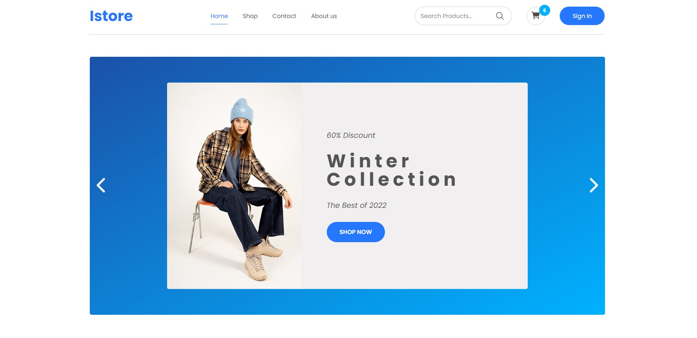

<div style="display:flex; align-items: center">
  <h1 style="position:relative; top: -6px" >istore - ecommerce</h1>
</div>

---



This is an e-commerce web application with my vision of design. Data is fetched from a free API. You can view the main page and also the shop page, where you can see certain products if you click an item. by clicking on add button, item will add to cart and also you can see your cart where are chosen products. Job is not finished, site is under working!!!

#

### Table of Contents

- [Prerequisites](#prerequisites)
- [Tech Stack](#tech-stack)
- [Getting Started](#getting-started)

### Prerequisites

-  _Node JS @12.X and up_
-  _Yarn @1.X and up_
-  _npm @6 and up_

#

### Tech Stack

-  [React @18.2.0](https://reactjs.org) - front-end framework
-  [SCSS @3.2.4] - CSS with superpowers

#

### Getting Started

1\. First of all you need to clone repository from github:

```sh
git clone https://github.com/datomaluta/Istore-shop.git
```

2\. Next, go to app directory with this command

```sh
cd Istore-shop
```

3\. Next step requires install all the dependencies.

```sh
npm install
```

or

```sh
yarn
```

4\. after that you can run application from terminal:

```sh
npm run dev
```

#
